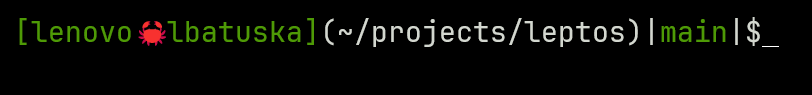

A basic prompt written in rust

```bash
RUSTFLAGS="-C target-cpu=native" cargo build --release
```

```bash
if [ -f "$HOME/projects/powerline-rust/target/release/powerline-rust" ] && [ "$TERM" != "linux" ]; then
  export PROMPT_COMMAND='PS1="$("$HOME/projects/powerline-rust/target/release/powerline-rust" $?)"; '"$PROMPT_COMMAND"
fi
```


